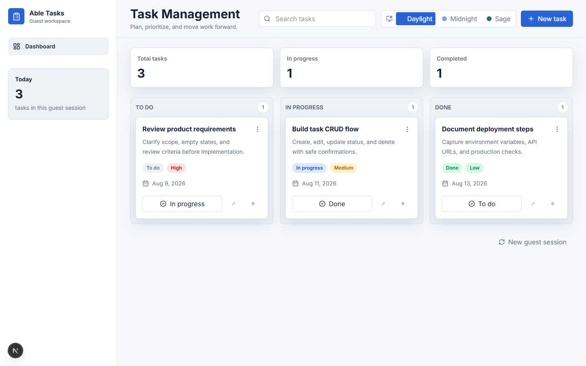
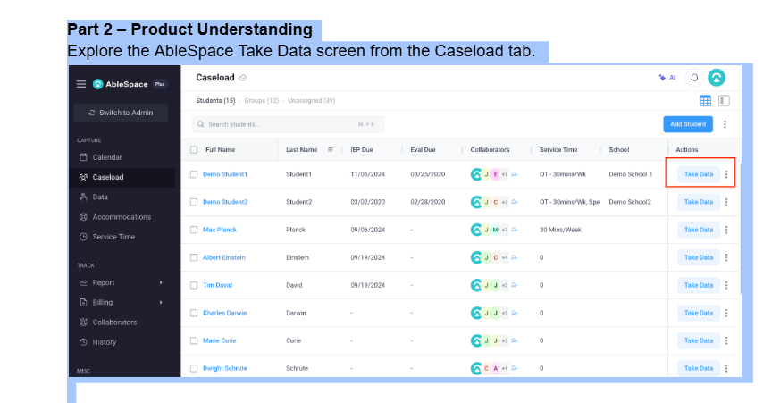

# Task Management Assessment

## Live Demo

Frontend: _add Vercel URL_

Backend API: _add deployed API URL_

Swagger: _add deployed `/docs` URL_

Repository: https://github.com/kanishik0011/task-management-

## Screenshots

### Task Dashboard



### Part 2 - AbleSpace Take Data Entry Point



## Tech Stack

- Frontend: Next.js App Router, React, TypeScript, Tailwind CSS, React Hook Form, Zod, TanStack Query, Lucide icons
- Backend: NestJS, TypeScript, REST, class-validator, class-transformer, Swagger/OpenAPI
- Database: SQLite with Prisma ORM for local/demo simplicity

## Features

- Guest login with isolated task data
- Task create, read, update, status change, and delete
- Delete confirmation and friendly async error states
- Browser demo fallback if the deployed API is temporarily unreachable
- Persistent theme switching with CSS variables
- Responsive dashboard for desktop, tablet, and mobile
- Swagger API docs and health endpoint
- Focused backend and frontend tests

## Architecture

The repo uses a small monorepo structure:

```text
apps/web  - Next.js frontend
apps/api  - NestJS backend
docs      - product understanding deliverables
```

The frontend keeps API calls in `src/lib/api.ts` and uses TanStack Query for server state. The backend keeps controllers thin and moves business rules into services. Prisma owns persistence and task records are always scoped by guest id.

If the frontend cannot reach the API, it falls back to a browser-local demo workspace so the Vercel deployment remains reviewable instead of showing a broken fetch screen. The intended full-stack path is still the Nest API, and production submissions should set `NEXT_PUBLIC_API_URL` to the deployed backend.

## Guest Authentication

`POST /auth/guest` creates a guest record, seeds a few realistic demo tasks, and returns a JWT. The frontend stores the token in `localStorage` so refreshes preserve the intended guest workspace. API requests use `Authorization: Bearer <token>`, and the Nest guard validates the token before attaching the guest context to the request.

This avoids a full registration system while still preventing one guest from reading or mutating another guest's tasks.

## Theme Implementation

Themes are centralized through CSS variables and a `data-theme` attribute on the document root. `ThemeProvider` persists the selected theme in `localStorage` and applies it immediately on change.

Available themes in this implementation:

- Daylight
- Midnight
- Sage

## API Endpoints

- `GET /health`
- `POST /auth/guest`
- `GET /tasks`
- `GET /tasks/:id`
- `POST /tasks`
- `PATCH /tasks/:id`
- `DELETE /tasks/:id`
- `GET /docs` for Swagger

All task endpoints require a guest bearer token.

## Database Schema

The schema intentionally stays small:

- `Guest`: generated guest identity
- `Task`: title, optional description, status, priority, optional due date, timestamps, and guest ownership

Indexes are added for guest/status and guest/due-date queries.

## Local Setup

```bash
npm install
cp .env.example apps/api/.env
cp .env.example apps/web/.env.local
npm run prisma:generate -w apps/api
npm run db:setup -w apps/api
npm run dev
```

Frontend runs on `http://localhost:3000`.

Backend runs on `http://localhost:4000`.

Swagger runs on `http://localhost:4000/docs`.

## Environment Variables

```bash
NEXT_PUBLIC_API_URL=http://localhost:4000
DATABASE_URL="file:./dev.db"
JWT_SECRET="replace-me"
FRONTEND_URL=http://localhost:3000
PORT=4000
```

Never commit real secrets.

## Design Decisions

- CSS variables keep theme-specific styling centralized.
- TanStack Query is used only for API state because task reads/mutations need loading, error, invalidation, and refresh behavior.
- Guest auth is deliberately lightweight and interview-friendly.
- The dashboard uses columns on wide screens and keeps mobile navigation off-canvas for small viewports.

## Intentional Deviations from Figma

The coding environment could not directly inspect the Figma file through the available public web surface, and an installed Figma inspection connector was not available. I implemented a polished, restrained task dashboard based on the assignment requirements and documented the theme names as assumptions. With Figma access, the next step would be to replace the assumed tokens with exact colors, spacing, typography, and theme variants from the file.

## Validation and Error Handling

The backend validates DTOs with `class-validator`, strips unknown fields, and returns safe error responses through a global exception filter. The frontend validates task forms with Zod, disables buttons while submitting, and shows friendly error messages instead of crashing.

## Responsive Design

The UI is designed for desktop, laptop/tablet, and mobile widths. The sidebar becomes an off-canvas navigation on smaller screens, cards fit one column on mobile, and dialogs use full available width with touch-friendly controls.

## Accessibility

The app uses semantic buttons, input labels, keyboard focus states, `aria-label` on icon-only controls, dialog roles, and meaningful headings.

## Testing

```bash
npm run test
npm run lint
npm run build
```

Included tests:

- backend service tests for guest scoping and update protection
- frontend form tests for validation and normalized payload submission

## Deployment

Recommended deployment:

- Frontend: Vercel
- Backend: Render, Railway, Fly.io, or a similar Node host
- Database: SQLite for a simple demo host with persistent disk, or PostgreSQL if the deployment target provides managed Postgres

### Vercel Frontend Setup

When importing the GitHub repo into Vercel, use the repository root. The root `vercel.json` already points Vercel to the web app output:

- Framework Preset: `Next.js`
- Root Directory: leave empty / repository root
- Install Command: `npm install`
- Build Command: `npm run vercel-build`
- Output Directory: `apps/web/out`

Set this Vercel environment variable:

```bash
NEXT_PUBLIC_API_URL=https://your-deployed-api-url
```

Do not leave `NEXT_PUBLIC_API_URL` as `localhost` in production.

The frontend uses `output: 'export'`, so Vercel serves it as static files instead of a serverless function. This avoids frontend `FUNCTION_INVOCATION_FAILED` crashes and keeps the UI available even while the backend is deployed separately.

### Backend Setup

Deploy `apps/api` separately on a Node host. The backend must be live before the Vercel frontend is reviewed.

Production checklist:

- Set `NEXT_PUBLIC_API_URL` to the deployed API URL.
- Set `FRONTEND_URL` to the deployed frontend URL.
- Run `npm run prisma:generate -w apps/api` and `npm run db:setup -w apps/api` for SQLite demo deployment, or create migrations if switching to PostgreSQL.
- Test guest login, task CRUD, refresh persistence, theme persistence, Swagger, and CORS from an incognito browser.

## Trade-offs

- Demo tasks are seeded for each new guest so reviewers immediately see a populated board.
- A simple JWT guest flow was chosen over registration to match the assignment scope.
- SQLite was chosen for this completed fresher-assessment build so reviewers can run the full stack locally without provisioning a database.
- The frontend includes a local demo fallback for API outages, but the full-stack submission should still provide a live backend URL.
- Exact Figma token fidelity is pending direct design inspection.

## Future Improvements

- Replace assumed visual tokens with exact Figma values.
- Add drag-and-drop status movement if the design supports it.
- Add pagination or virtualized lists if task volume grows significantly.
- Add Playwright smoke tests for the deployed flow.

## Part 2 Product Understanding

See `docs/part-2-product-understanding.md`.

## Assessment Checklist

See `docs/assessment-checklist.md`.

## Submission Guide

See `docs/submission-guide.md`.
